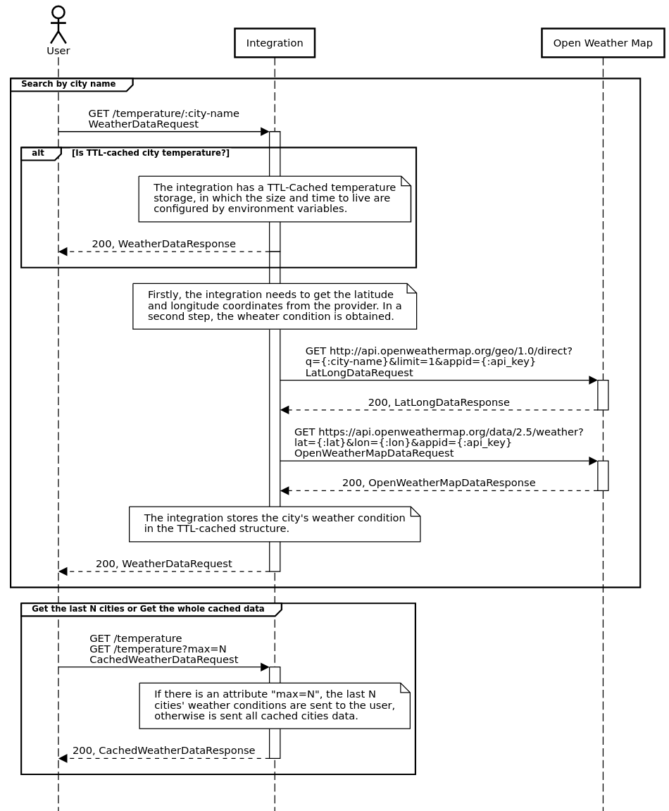

# Open Weather Map Integration API

This application works as an integration to the "Open Weather Map" data provider. It's designed to be an easy-to-use wrapper to the API, needing as input only the city name and delivering to the user common weather parameters: minimum, maximum, average and feels like temperatures. All the temperatures are converted to Celcius degrees. The temperature data are stored in a TTL cache-based structure, avoiding the integration to fetch recently acquired data. In the section below, you can verify a sequence diagram, explaining the integration workflow. 

This application creates a Unix socket by default. The socket therefore can be exposed to the web using an Nginx-like reverse proxy application. If you want to run exposing
a port, modify the files `docker-compose.yaml` and `weather_api/Dockerfile`

## Usage

| Request                      | Description                           | Example                               |
|------------------------------|---------------------------------------|---------------------------------------|
| **GET** /temperature             | Gets all the cached temperature data  | api.mathias.dev.br/temperature        |
| **GET** /temperature?max=N       | Gets last N cached temperature data   | api.mathias.dev.br/temperature?max=2  |
| **GET** /temperature/:city-name | Gets the temperature of the city-name | api.mathias.dev.br/temperature/london |

## How to configure

There are 3 environment variables in the docker-compose.yml file that must be set:

- CACHE_TTL: Time To Live in seconds for the cached requests
- DEFAULT_MAX_NUMBER: Max number of cached messages stored
- API_KEY: OpenWeather api key

## How to run

- At the first time

`docker-compose up --build`

- After the first time

`docker-compose up -d`

## How to test

`docker-compose run --rm weather_api python3 -m unittest`

## How it works?

